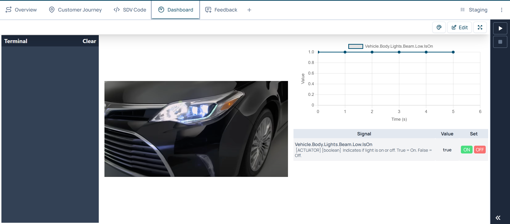

# IAA LCV BYOD Hackathon

digital.auto and prototype.club invite teams to develop new solutions for Lightweight Commercial Vehicles (LCVs) based on a Bring-Your-Own-Device (BYOD) platform.

The goal is to explore how external customer devices can be securely connected, onboarded, and integrated into software-defined commercial vehicles.

A pre-installed camera serves as the first reference device and provides a practical starting point for the hackathon challenges.

## Hackathon Goal

The hackathon explores how BYOD concepts can enable new applications and services for commercial vehicles.

Participants will:

- Develop a prototype based on one of the provided challenges
- Use the camera as an initial reference device
- Connect their solution with the digital.auto environment
- Explore how additional devices could be integrated in the future
- Provide feedback on the BYOD concept and developer experience

## Bring-Your-Own-Device Concept

### What do we mean by BYOD?

Bring-Your-Own-Device describes an approach in which external devices can be connected to and integrated with a software-defined vehicle (SDV).

Possible devices could include:

- Cameras
- Smartphones
- Sensors
- Smart tools
- Wearables
- Trailer devices
- External accessories
- IoT devices

For this hackathon, a camera is provided as the first reference device.

The camera is therefore not the limitation of the BYOD concept, but an example of how external devices can become part of the vehicle ecosystem.

## Challenge Areas

Teams can choose one of the following challenge areas.

### Challenge 1: Mobile Workshop / Contractor's Cart

Explore how computer vision can support a mobile workshop or contractor's vehicle.

Possible topics:

- Tool detection
- Missing tool identification
- Inventory monitoring
- Tool usage tracking
- Loading completeness
- Theft prevention

### Challenge 2: Dangerous Goods Monitoring

Explore how external devices and cameras can improve the handling and transport of hazardous materials.

Example: gas cylinders.

Possible topics:

- Detecting gas cylinders
- Monitoring their position
- Detecting incorrect storage
- Detecting missing safety equipment
- Supporting loading checks
- Generating safety warnings

### Challenge 3: Animal Transport

Explore how devices and cameras can support animal transport.

Possible topics:

- Animal detection
- Animal behavior monitoring
- Position monitoring
- Unusual movement detection
- Transport safety
- Well-being indicators

### (Optional) Challange 4. Think Beyond the Camera

The camera is the starting point, not the final goal.

During the hackathon, we encourage teams to think about:

- What additional devices could improve your solution?
- What vehicle data would your device need?
- What information could your device provide to the vehicle?
- How should a new device be discovered and onboarded?
- What permissions should a device receive?
- How could the same application work with different devices?
- What would a future BYOD ecosystem for commercial vehicles look like?

## Additional Hackathon Sensor Inventory

To support advanced prototyping and sensor fusion projects, the organizing team has a limited supply of extra hardware modules available upon request. Teams interested in expanding their application capabilities can borrow any of the following sensors:

* **Radar Sensor**: Ideal for object detection, distance measurement, and proximity monitoring use cases.
* **Bosch Gas Sensor**: Suitable for environmental monitoring, air quality tracking, and cabin air analysis.
* **PM Sensor**: Enables precise particulate matter detection for air pollution and cabin environment monitoring.

> **Note**: These components are available on a request basisand has to be setup on your own. If your team wishes to integrate any of these sensors into your solution, please coordinate with a hackathon supervisor or technical mentor to check availability.

## digital.auto Playground

The digital.auto Playground provides the software environment for developing and testing vehicle applications.

During the kickoff, participants will receive an introduction to:

- digital.auto Playground
- Vehicle APIs / vehicle signals
- Prototyping applications
- Connecting external devices
- Running and testing applications

> **Note**: Participants have to develop their application primarily on digital.auto playground.

# Getting Started

Select one of the three challenge areas and define your usecase.

Define:

- What problem are you solving?
- Who is the user?
- What should the camera or device detect?
- What should happen after an event is detected?

## 1. Getting Started with digital.auto Playground

1.1 **Access the Platform**: Open the [digital.auto Playground](https://playground.digital.auto/).  
1.2 **Login & Select Model**: Log in, select your vehicle models, and choose the vehicle model **IAA Hannover Hackathon 2026**.  
1.3 **Create a Prototype**: Set up your prototype and select a **multi-files project** and name it as your team name.
     
1.4 **Develop in SDV Code**: Navigate to the **SDV Code** tab to write your source code and manage your project files.
    

## 2. Configuring and Running Your Runtime

To execute your application inside the playground, you need to configure a runtime environment:

2.1 Open the terminal by clicking the arrow icon located in the **bottom right corner**.
     
2.2 Locate the runtime box to view current runtime information, then select **add runtime**.
     
2.3 In the popup window, enter your assigned runtime name using the pre-filled prefix `Runtime-`.
   
   * *Example*: For the name `IAA Hackathon`, enter `Runtime-IAA Hackathon`.
   * **Note**: Your runtime name will be provided by your hackathon supervisor. Reach out to them directly if you haven't received it.

## 3. Utilizing the Dashboard

Use the **Dashboard** section to load plugins that allow you to monitor vehicle behavior virtually and track real-time API value changes.  
Alternatively, you can embed and run a web application link directly within the dashboard view.

## 4. Accessing Camera Feeds and Endpoints

Three dedicated cameras have been set up for the hackathon. You can access their live feeds using the following stream links:

* **CAM -1**: `https://domain-reenter-boxer.ngrok-free.dev/video_feed`
* **CAM -2**: `https://routine-splurge-recast.ngrok-free.dev/video_feed`
* **CAM -3**: `xxxxxxxxxxxxxxxxxxx`

### Snapshot Upload Endpoints
Additional endpoints (`/upload_snapshot`, `/xxx2`, `/xxx3`) are provided where your application can post captured images or routine snapshots. Once uploaded, these snapshots can be accessed dynamically via the following URLs:

* **CAM -1 Snapshot**: `https://domain-reenter-boxer.ngrok-free.dev/view_2`
* **CAM -2 Snapshot**: `https://routine-splurge-recast.ngrok-free.dev/view`
* **CAM -3 Snapshot**: `yyyyyyyyyyyyyy`

**Note**: Links will be updated at the time of Hacakthon.

*Tip: Check the example prototype code for a working implementation of these API integrations.*

## 5. Example Prototype Reference

To help you get started, review the official example prototype. This implementation demonstrates how to capture an image, trigger the vehicle headlights, and sound the horn when a sleepy driver is detected:

* [Example Prototype Code Link](https://playground.digital.auto/model/67d2eb3e880fe100272d033e/library/prototype/6a9684f804417b08156ceb7a/code)

# Final Pitch & Showcase

Before stepping into your final showcase, review the guidance below on how to structure your presentation, meet the expected deliverables, and hit the key criteria the judges are looking for.

## Demonstrate Your Idea

Prepare a short demonstration showing:

- The problem
- Your solution
- Device / camera input
- Vehicle or digital.auto interaction
- Potential future BYOD extensions

## Expected Output

Each team should aim to provide:

- A working prototype or proof of concept
- A short description of the use case
- Source code
- A short demo
- An explanation of how BYOD is used in the solution

Optional:

- Architecture diagram
- Additional device concepts
- Ideas for future vehicle integration
- Feedback on the BYOD platform

## Evaluation Criteria

Potential evaluation dimensions:

- Relevance of the problem
- Creativity of the solution
- Technical implementation
- Use of digital.auto
- BYOD integration concept
- User value
- Scalability to additional devices
- Demo quality

# Feedback & Research

The hackathon also helps us understand how developers interact with BYOD concepts and software-defined vehicle platforms.

Participants may be invited to share feedback regarding:

- Ease of device integration
- digital.auto developer experience
- Technical challenges
- BYOD opportunities
- Desired APIs and platform capabilities
- Potential future use cases

More information will be provided during the event.

# Resources

digital.auto: [Link](https://www.digital.auto/)  
Wiki Documentation: [Link](https://docs.digital.auto/)  
Example Camera-based Prototype: [Link](https://playground.digital.auto/model/67d2eb3e880fe100272d033e/library/prototype/6a9684f804417b08156ceb7a/code)

# Technical & Hackathon Support

Chris Cheng: [LinkedIn](https://www.linkedin.com/in/xiangwei-cheng/)   
Mohammed Raihan Soniwala: [LinkedIn](https://www.linkedin.com/in/raihan-edin/)

# License

The repository includes an open-source license file governing the terms of use, modification, and distribution, learn more in LICENSE file.
